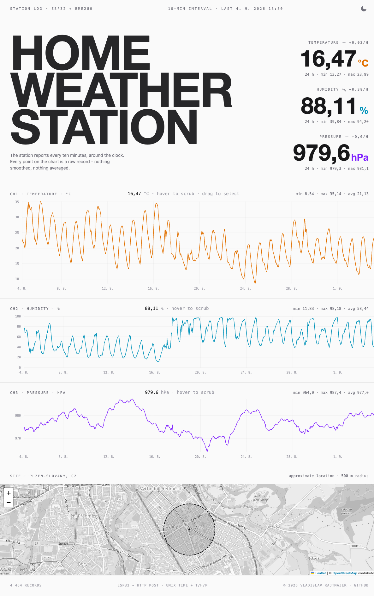

# Weather station

[](https://github.com/rajtik76/weather-station/actions/workflows/ci.yml)
[](https://status.rajtik.com)
[](https://status.rajtik.com)
[](LICENSE.md)

A home weather station, end to end. An ESP32 wakes on a timer, reads a BME280,
and uploads to a Laravel API that stores the readings and draws them.

```
BME280 --I2C--> ESP32 --HTTPS--> Laravel API --> PostgreSQL
                                      |
                                 Livewire dashboard
```

Running at [weather.rajtik.com](https://weather.rajtik.com).



The screenshot is seeded sample data, not measurements - the live station has
been reporting for days rather than the month the chart covers.

## Layout

| Path | Contents |
|---|---|
| `firmware/` | Arduino sketches. Wiring, protocol and the hardware notes worth keeping are in [`firmware/README.md`](firmware/README.md). |
| `app/Http/` | The ingest endpoint, its form request, and the bearer token middleware. |
| `app/ValueObject/` | Per-version decoding of a measurement payload. |
| `resources/views/components/` | The dashboard, one Livewire single-file component. |
| `.ai/rules/` | Conventions that are not obvious from reading the code. |

## API

One endpoint, bearer auth against `SENSOR_API_TOKEN`, 10 requests per minute.

```
POST /api/v1/measurement
Authorization: Bearer <token>
```

Uploads are batches. The firmware buffers what it could not deliver and sends
it on the next wakeup, so a batch is often a retry: `(sensor_name, timestamp)`
is unique and the write upserts, which makes a partially delivered batch safe
to send again. One invalid entry rejects the whole batch, so a bad reading
never wedges the ones queued behind it. Payload shape, units and ranges are in
the firmware README.

The protocol is versioned. `protocol_version` is a column of its own and never
lives inside the stored blob; `ProtocolVersion` maps a version to the value
object that validates and decodes it. A new firmware format is a new case and a
new class, and rows written by older firmware stay readable.

## Running it

Needs PHP 8.4 and Node 22. Flux Pro is a paid package, so `auth.json` has to
carry credentials for `composer.fluxui.dev`.

```
composer setup     # install, .env, app key, migrate, build assets
composer dev       # server, queue worker, logs, vite
composer test
composer review    # rector, phpstan, tests
```

SQLite locally, PostgreSQL in production. `MeasurementSeeder` fills the
dashboard's window at the reporting interval, which is the fastest way to get
something on the chart without a device on the desk.

## Deployment

Coolify on a Hetzner VPS, nixpacks build pack, shared PostgreSQL. A push to
`main` triggers the deploy webhook, and `php artisan migrate --force` runs
after it. Commits that only touch `firmware/` are excluded from the watch
paths and do not redeploy the site.

Two Uptime Kuma monitors sit behind the badges. One polls the site. The other
is a push monitor with a one hour interval that the ingest endpoint pings after
storing a batch, so an hour of silence raises an alert - it catches a station
that stopped reporting, which polling the site never would.
